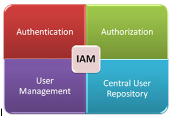

<!-- This template removes the micro tutorial for a quicker post and removes images for a full template check out the 000-DAY-ARTICLE-LONG-TEMPLATE.MD-->

**Add a cover photo like:**

# Identity and Access Management (IAM) - Part I

## Introduction

Identity and Access Management (IAM) is one of the important part in cloud technology. It is also one of the key areas that will came up on AWS SAA certification test. Luckily, most of the course that I bought has IAM topic and thus, this is Part I of the study.

## Use Case

- IAM provides identity and access management for access to the Management Console and AWS services.
- When we have application on AWS, IAM will help us to prevent unauthorized entity and limit some of our internal staff access right.

## Cloud Research

- Root user is the administrator user and can do anything. Use root if regular user can't do that.
- Roles are not used as login account but for permission in AWS services.
- In short, IAM concepts are: resources, principals, and policies.
- Create users when you're the only person working with the account, multiple people need permanent access, one or more users require CLI access.
- Create roles when applications need access to an AWS service, mobile phone apps make requests of AWS, existing company users need federated access.
- In AWS, authentication can be for person or process. For person, authentication is used to manage AWS. For process, authentication is done through Roles
- In AWS, Authorization can be Identity based policies (used with users, groups, or roles) and Resource-based policies (used for cross-account). It ensure that actions are allowed before the are processed.
- By default, all requests are denied. Explicit allow overrides the default. Permission boundaries can override explicit allows. Explicit denies override explicit allows.
- Key (access key id and secret access key) rotation is very important and best practice. Key rotation only applies to user accounts.
- DO NOT delete the old key that are still active when we haven't activate the new key.
- To list a key, run `aws iam list-access-keys --user-name Alice`
- For multiple permissions, all *Allowed* permissions is accumulative, and all *Denied* permissions is override.

## Social Proof

✍️ Show that you shared your process on Twitter or LinkedIn

[Twitter](https://twitter.com/Rizary_Andika/status/1345987286828138498)
[LinkedIn](https://www.linkedin.com/feed/update/urn:li:activity:6750340365867454464?commentUrn=urn%3Ali%3Acomment%3A%28activity%3A6750340365867454464%2C6751753684448882688%29)
