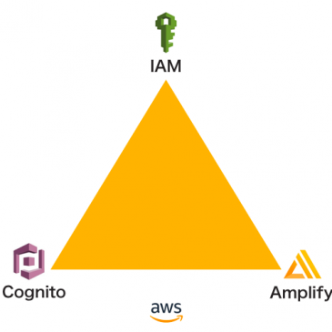

<!-- This template removes the micro tutorial for a quicker post and removes images for a full template check out the 000-DAY-ARTICLE-LONG-TEMPLATE.MD-->

**Add a cover photo like:**

# IAM, Cognito and Amplify to Power-ups AWS Stack

## Introduction

Today I get an opportunity to talk with AWS DevOps Consultant who uses all AWS service (He prefer CloudFormation than Terraform). While studying IAM, I am able to ask him a lot of questions regarding Cognito, IAM, and the new Amplify services. This is great as it gives me additional knowledge from real-world practice.

## Use Case

- You have serverless application and you want to create user session as well as manage your user.
- You want to create web application but you don't want to manage the deployment, etc. yourself.
- You want to use SDK in the frontend instead of adding API Gateway and Lambda in between your app and your services.

## Cloud Research

- IAM user accounts can be created in the CLI or the Management Console. You can choose custom resources policy in AWS.
- Cognito is used to create user session and to manage user.
- At first, you can create 3 AWS account. 1 account is for organization and then setup 2 other account under the organization (example devs and prod account).
- By doing that, you can switch account and just change cognito id, pool id, etc.
- For services like DynamoDB, AWS Lambda, and S3, you can access it directly from the frontend using Cognito.
- Cognito is useful for direct acces. For example, if we make dynamodb, and the user id is cognito id, then we can have policy that the primary key of dynamodb need to match user id to access the data.
- The same goes with S3 such as put the bucket's name contains the cognito id.
- Only use api gateway to webhooks or to interact into RDS datatype.
- you can embed policy into a role. array of policy and put everything into one role.

## Social Proof

[Twitter](https://twitter.com/Rizary_Andika/status/1346139788873617408)
[LinkedIn](https://www.linkedin.com/feed/update/urn:li:activity:6750340365867454464?commentUrn=urn%3Ali%3Acomment%3A%28activity%3A6750340365867454464%2C6751905799418863616%29)